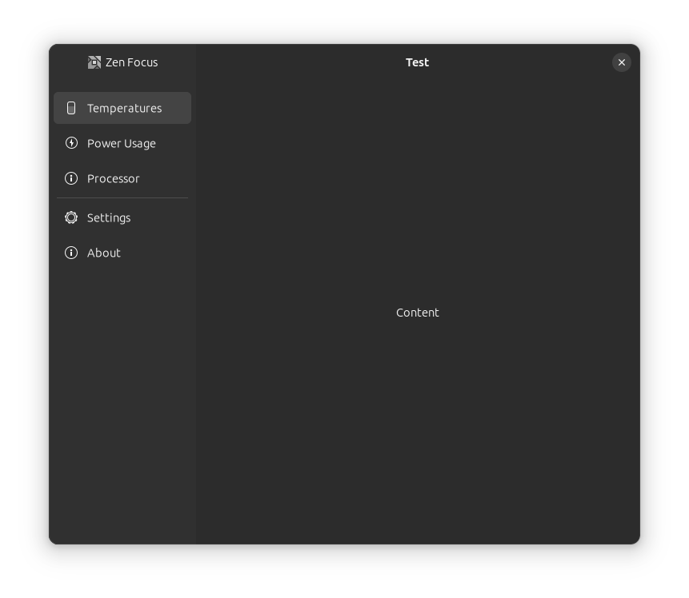

## Zen Focus

This is currently under heavy development.

It is a Python GUI GTK4 application for Ubuntu 23.10+ using the Adw (libadwaita) library that monitors Ryzen CPUs via ryzen_smu and k10temp kernel modules.

It uses the latest features of `libadwaita 1.4+` to make a responsive, scalable, modern interface in the style of Ubuntu native applications.

#### Protoype Layout
